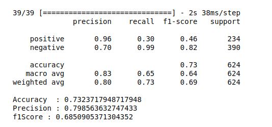
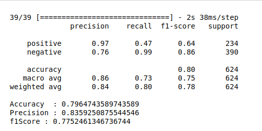

## Dataset 

Download: https://www.kaggle.com/datasets/paultimothymooney/chest-xray-pneumonia

* Extract into a folder named "DS2"

Structure should look like this:

```
DS2/test
   /train
   /val 

```


## How to run

The code lives in the ```XrayClassification.ipynb``` file. The modified activation function is in ```snnlib/```. 

To compare the two different models, the traditional ANN and the SNN, there are two functions available, for the SNN:

``` model = getSpikeModel()```

for the traditional model:

``` model = getTradModel()```

## Results

<b> Looking at the F1 metric of the test set now:</b>

### Traditional model (ANN - Artificial neural network):



### SNN (Spiking neural network):




